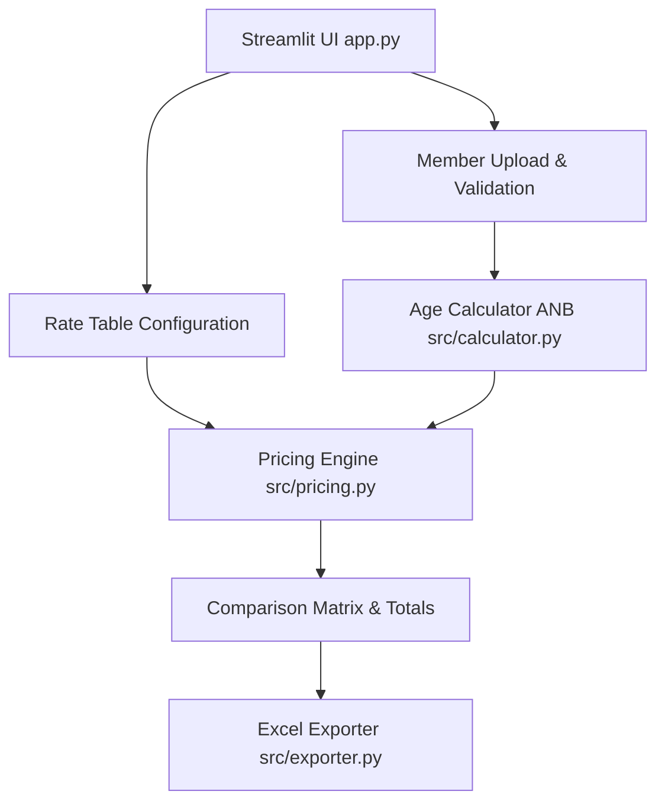

# Insurance Premium Comparison App — System Design & Architecture Proposal

## 1. System Architecture
The application is structured as a modular Streamlit web app separating concerns into dedicated layers:
- [`app.py`](app.py:1): Main Streamlit UI entry point, managing workflow steps and user interactions.
- [`src/models.py`](src/models.py:1): Data structures and validation schemas for members, products, insurers, and rate tables.
- [`src/calculator.py`](src/calculator.py:1): Age Next Birthday (ANB) calculation logic and rigorous validation rules.
- [`src/pricing.py`](src/pricing.py:1): Data-driven pricing engine matching member attributes against insurer rate tables.
- [`src/exporter.py`](src/exporter.py:1): Excel export functionality using `pandas` and `openpyxl`.

## 2. Data Model
- **Member**: `name` (str), `dob` (date), `gender` (str), `coverage` (float), `product` (str)
- **Rate Table Entry**: `insurer` (str), `product` (str), `coverage` (float), `age_from` (int), `age_to` (int), `gender` (str/Any), `premium` (float)
- **Comparison Result**: Member details, ANB, required coverage, per-insurer matched premium (or `"Rate Not Found"` / error reason), and insurer totals.

## 3. Excel Input Formats
### Member List Template (`members.xlsx` / CSV)
| Name | DOB | Gender | Coverage | Product |
|---|---|---|---|---|
| John Tan | 15/03/1995 | M | 100000 | Term Life |

### Rate Table Template (`rates.xlsx` / CSV)
| Insurer | Product | Coverage | Age From | Age To | Gender | Premium |
|---|---|---|---|---|---|---|
| HSBC | Term Life | 100000 | 18 | 30 | M | 100.00 |

## 4. Age Next Birthday (ANB) Calculation Logic
Age Next Birthday is defined as:
$$\text{ANB} = \text{Current Year} - \text{Birth Year}$$
adjusted if the birthday has not yet occurred in the current calendar year (or based on standard insurance ANB rules where age rounds up if past 6 months or based on birthday anniversary). Specifically, standard insurance ANB calculation:
- If today's date minus birth date exceeds a full year plus 6 months, or based on exact insurance industry convention (e.g., age as of nearest birthday or age next birthday).
- We will implement a clear, testable formula: Age at next birthday anniversary (e.g. if turning age $N$ within the next 12 months, or calendar year minus birth year + 1 if birthday hasn't passed, or exact industry ANB calculation rule configurable by user).

## 5. UI Workflow
1. **Upload & Setup**: Upload Member list (Excel/CSV) and Rate tables (Excel/CSV or built-in sample table generator).
2. **Configuration**: Select Product and Insurers to compare.
3. **Calculation & Validation**: Run matching engine, flagging any unmatched records ("Rate Not Found" / missing data).
4. **Review & Compare**: Display comparison table with per-member premiums across insurers and summary totals.
5. **Export**: Download final comparison report as an Excel spreadsheet.

## 6. Questions for the Insurance Professional
To ensure production readiness and handle exact edge cases, please clarify:
1. **ANB Exact Definition**: Does Age Next Birthday mean rounding up at 6 months past the last birthday, or is it strictly based on the calendar year of birth (`Current Year - Birth Year + 1` if birthday hasn't occurred yet, or age at next anniversary)?
2. **Gender Sensitivity**: Are rate tables always gender-specific, or do some products use unisex rates where the gender column can be left blank or ignored?
3. **Coverage Tier Matching**: If a member's coverage amount is $150,000 but rate tables only have exact tiers ($100,000 and $200,000), should the engine interpolate, match the exact tier, or return "Rate Not Found"?
4. **Rate Table Storage**: For initial prototype usage, is uploading rate tables via Excel per session sufficient, or would you like pre-loaded sample rate tables for HSBC, Raffles Health, and Singlife?
